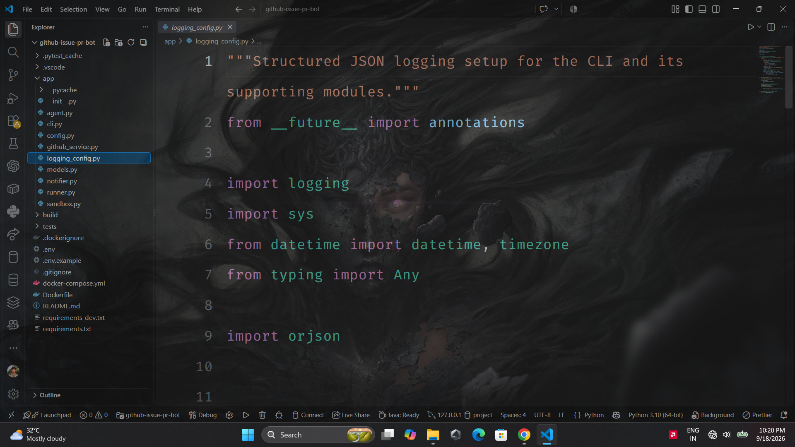
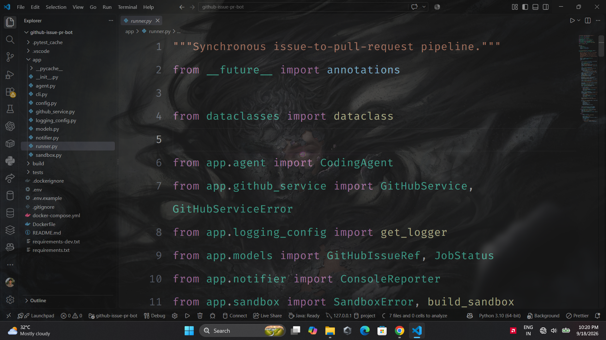

# PRCraft

### Forge code. Automate PRs. Ship faster.

**PRCraft** is an open-source, Python-based AI developer tool that turns
a GitHub Issue into a Pull Request with minimal manual intervention.

Give PRCraft a GitHub Issue URL. It fetches the issue, resolves
repository access, creates an isolated workspace and fix branch, lets a
coding agent analyze and implement the fix, then commits, pushes, and
opens the Pull Request.

> **GitHub Issue → AI Agent → Code Changes → Commit → Push → Pull
> Request**

------------------------------------------------------------------------

## 🎥 Demo

PRCraft is designed to work directly from the terminal while showing
live progress throughout the workflow.

### Demo Video 1


### Demo Video 2


------------------------------------------------------------------------

## 📸 Screenshots

### PRCraft running inside VS Code



### GitHub Issue used as the automation trigger



------------------------------------------------------------------------

## ✨ Features

-   🤖 **AI-powered issue resolution** --- analyzes an issue and works
    through a coding/fix loop.
-   🔄 **End-to-end Issue → PR pipeline** --- automates repository
    preparation, coding, commit, push, and PR creation.
-   🔀 **Flexible repository access** --- pushes directly when the bot
    has repository access or creates/uses a fork for external
    repositories.
-   🧰 **Isolated sandbox execution** --- supports local and Docker
    sandbox backends.
-   🐳 **Docker isolation** --- optional containerized execution with
    network isolation and resource restrictions.
-   📡 **Live terminal progress** --- displays processing, coding, push,
    PR, and failure states in real time.
-   📋 **Structured logging** --- JSON logs can be written separately
    from human-readable console output.
-   🔐 **Path-boundary enforcement** --- repository tools reject
    absolute-path escapes and `../` traversal outside the assigned
    workspace.
-   🔑 **Secret protection** --- GitHub credentials are redacted from
    logged Git commands and secrets are kept in environment variables.
-   🧪 **Automated tests** --- includes tests for issue URL parsing,
    GitHub service behavior, agent behavior, and sandbox safety.
-   🐳 **Docker Compose support** --- run PRCraft conveniently inside a
    container.

------------------------------------------------------------------------

## 🧭 How PRCraft Works

``` text
Paste GitHub Issue URL
          │
          ▼
      app/cli.py
   Extract Issue URL
          │
          ▼
     app/runner.py
    Orchestrate Pipeline
          │
     ┌────┴─────────────────────────────┐
     ▼                                  ▼
Fetch GitHub Issue              Resolve Repository Access
     │                                  │
     └──────────────┬───────────────────┘
                    ▼
             Create Fix Branch
                    │
                    ▼
          Isolated Repository Sandbox
                    │
                    ▼
             CodingAgent
       Analyze → Modify → Validate
                    │
                    ▼
              Commit Changes
                    │
                    ▼
               Push Branch
                    │
                    ▼
              Open Pull Request
                    │
                    ▼
             ✅ PR Created
```

The pipeline is synchronous and can be triggered manually by providing
an issue URL. No webhook server or message queue is required.

------------------------------------------------------------------------

## 🏗️ Architecture

``` text
app/
├── cli.py
│   └── Entry point and issue URL extraction
│
├── runner.py
│   └── End-to-end issue → agent fix → PR orchestration
│
├── github_service.py
│   └── GitHub issue, repository access, fork/clone,
│       branch, commit, push and PR operations
│
├── agent.py
│   └── AI coding agent and repository tool loop
│
├── sandbox.py
│   └── Local/Docker execution with workspace path enforcement
│
├── notifier.py
│   └── Human-readable terminal progress reporting
│
├── models.py
│   └── Shared Pydantic models
│
├── config.py
│   └── Environment-driven configuration
│
└── logging_config.py
    └── Structured JSON logging
```

------------------------------------------------------------------------

## 📁 Repository Structure

``` text
PRCraft/
├── app/
│   ├── __init__.py
│   ├── agent.py
│   ├── cli.py
│   ├── config.py
│   ├── github_service.py
│   ├── logging_config.py
│   ├── models.py
│   ├── notifier.py
│   ├── runner.py
│   └── sandbox.py
│
├── tests/
│   ├── test_agent.py
│   ├── test_github_service.py
│   └── test_sandbox.py
│
├── Dockerfile
├── docker-compose.yml
├── .dockerignore
├── .env.example
├── .gitignore
├── requirements.txt
├── requirements-dev.txt
└── README.md
```

------------------------------------------------------------------------

## ⚙️ Prerequisites

Before running PRCraft, make sure you have:

-   **Python 3.11+**
-   **Git**
-   **Docker** --- recommended when using `SANDBOX_BACKEND=docker`
-   A **GitHub Personal Access Token** for the bot account with the
    required `repo` permissions
-   An API key for the configured AI model provider

------------------------------------------------------------------------

## 🚀 Installation

### 1. Clone the repository

``` bash
git clone https://github.com/<your-username>/PRCraft.git
cd PRCraft
```

### 2. Create a virtual environment

#### Windows

``` powershell
python -m venv .venv
.venv\Scripts\Activate.ps1
```

#### macOS / Linux

``` bash
python3 -m venv .venv
source .venv/bin/activate
```

### 3. Install dependencies

``` bash
pip install -r requirements-dev.txt
```

### 4. Configure environment variables

``` bash
cp .env.example .env
```

On Windows, you can copy the file manually if `cp` is unavailable.

Edit `.env` and configure your GitHub credentials, AI provider
credentials, model, and sandbox settings.

> **Never commit `.env` or expose your API keys.**

------------------------------------------------------------------------

## 🔐 Configuration

PRCraft uses environment-driven configuration.

Typical settings include:

``` env
GITHUB_TOKEN=your_github_token
ANTHROPIC_API_KEY=your_anthropic_api_key
ANTHROPIC_MODEL=your_model
SANDBOX_BACKEND=docker
AGENT_MAX_ITERATIONS=...
SANDBOX_KEEP_WORKSPACE_ON_FAILURE=true
```

Use `.env.example` as the source of truth for the configuration
supported by your version of PRCraft.

------------------------------------------------------------------------

## ▶️ Usage

### One-shot mode

Pass a GitHub Issue URL directly:

``` bash
python -m app.cli https://github.com/your-org/your-repo/issues/17
```

### Interactive mode

``` bash
python -m app.cli
```

Then paste:

``` text
https://github.com/your-org/your-repo/issues/17
```

### Loop mode

Process multiple issues sequentially:

``` bash
python -m app.cli --loop
```

PRCraft can also extract the first GitHub Issue URL from a longer pasted
message:

``` text
Please fix this issue:
https://github.com/your-org/your-repo/issues/17
```

------------------------------------------------------------------------

## 📟 Example Output

``` text
[14:02:11] ⏳ Processing issue #17 in your-org/your-repo...
[14:02:12] 🔧 Fetched issue: "Crash on empty input"
[14:02:12] 🔧 Preparing repository your-org/your-repo...
[14:02:15] 🔧 Created branch fix/issue-17
[14:02:15] 🔧 Analyzing the issue and working on a fix...
[14:03:40] 🔧 Pushed branch, opening pull request...
[14:03:41] ✅ PR Created: https://github.com/your-org/your-repo/pull/18

Summary:
Fixed a null-pointer style crash when parse_input() received
an empty string by adding an explicit empty-input check
and a regression test.
```

If the agent or GitHub/sandbox pipeline fails, PRCraft reports the
failure and exits with a non-zero status code, making it suitable for
scripting and CI workflows.

------------------------------------------------------------------------

## 🐳 Run with Docker

Build the image:

``` bash
docker compose build
```

Run with an Issue URL:

``` bash
docker compose run --rm ghbot \
  https://github.com/your-org/your-repo/issues/17
```

Or run interactively:

``` bash
docker compose run --rm ghbot
```

### Docker sandbox

When using the Docker sandbox backend, PRCraft can launch repository
work inside a restricted container environment.

The sandbox configuration uses:

-   `--network none`
-   Resource limits
-   `--no-new-privileges`
-   Workspace path-boundary validation

If you prefer the local backend, set:

``` env
SANDBOX_BACKEND=local
```

and remove the Docker socket mount from `docker-compose.yml`.

> Local execution is simpler, but provides weaker isolation than the
> Docker backend.

------------------------------------------------------------------------

## 🔀 Repository Access Strategy

PRCraft automatically determines how it can work with the target
repository.

### Direct access

If the bot account has push access:

``` text
Target Repository
      ↓
Clone
      ↓
Create fix branch
      ↓
Push branch
      ↓
Open PR
```

### Fork-based access

For repositories where the bot does not have push access:

``` text
Upstream Repository
      ↓
Create / use Bot Fork
      ↓
Clone Fork
      ↓
Create fix branch
      ↓
Push to Fork
      ↓
Open PR → Upstream Repository
```

This allows PRCraft to work with external/public repositories without
requiring direct write access to the upstream repository.

------------------------------------------------------------------------

## 🛡️ Security

PRCraft is designed with isolation and secret handling in mind.

### Sandbox security

The Docker backend uses network isolation, resource limits, and
`--no-new-privileges`.

### Path traversal protection

Repository tools validate that paths resolve inside the assigned
workspace.

Attempts involving:

``` text
../
```

or absolute paths escaping the workspace are rejected.

### Credential protection

GitHub credentials are redacted from logged Git commands.

Keep these values secret:

``` text
GITHUB_TOKEN
ANTHROPIC_API_KEY
```

Your `.env` file should remain git-ignored.

### Failure inspection

When configured to do so, PRCraft preserves a failed workspace so
developers can inspect what the coding agent changed.

------------------------------------------------------------------------

## 🧪 Testing

Run the test suite with:

``` bash
pytest -q
```

Tests cover areas such as:

-   GitHub Issue URL parsing
-   GitHub service behavior
-   Coding-agent behavior
-   Sandbox path safety

------------------------------------------------------------------------

## 🧩 Extending PRCraft

PRCraft is intentionally structured so contributors can extend the
pipeline.

### Add repository tools

Repository tools can be added in:

``` text
app/agent.py
```

### Tune the agent

Configure values such as:

``` env
AGENT_MAX_ITERATIONS
ANTHROPIC_MODEL
```

### Add another trigger

The core pipeline is exposed through `run_issue_pipeline`, making it
possible to connect PRCraft to another interface later, such as:

-   Webhooks
-   Scheduled jobs
-   CI/CD pipelines
-   A web dashboard
-   Chat interfaces
-   Other automation systems

------------------------------------------------------------------------

## 🤝 Contributing

**PRCraft is open source, and contributions are welcome!**

Whether you want to fix a bug, improve the sandbox, add a new AI
provider, build a new repository tool, improve documentation, add tests,
or propose a new feature, you're welcome to contribute.

### Contribution workflow

1.  Fork the repository.
2.  Clone your fork.
3.  Create a feature branch:

``` bash
git checkout -b feature/your-feature
```

4.  Make your changes.
5.  Run the tests:

``` bash
pytest -q
```

6.  Commit your changes:

``` bash
git add .
git commit -m "feat: add your feature"
```

7.  Push your branch:

``` bash
git push origin feature/your-feature
```

8.  Open a Pull Request.

### Good contribution areas

-   🤖 AI/LLM integrations
-   🧠 Coding-agent improvements
-   🔐 Sandbox and security
-   🐳 Docker support
-   🧪 Test coverage
-   ⚡ Performance improvements
-   🔄 GitHub workflow automation
-   📚 Documentation
-   🎨 Developer experience
-   🔌 New repository tools and integrations

Please open an issue first for large architectural changes so the
approach can be discussed before implementation.

------------------------------------------------------------------------

## 🗺️ Roadmap

Potential future improvements include:

-   [ ] More AI model providers
-   [ ] Webhook-based issue triggers
-   [ ] GitHub Actions integration
-   [ ] Automated test execution and validation
-   [ ] Automated PR review
-   [ ] Better failure recovery
-   [ ] Multi-agent issue resolution
-   [ ] Web dashboard
-   [ ] Additional repository tools
-   [ ] Richer PR summaries and change reports

------------------------------------------------------------------------

## 📄 License

PRCraft is open source.

Add your project's chosen license file (for example, `LICENSE`) to
define the terms under which others can use, modify, and distribute the
project.

------------------------------------------------------------------------

## ⭐ Support the Project

If PRCraft is useful to you:

-   ⭐ Star the repository
-   🐛 Report bugs
-   💡 Suggest features
-   🔧 Contribute improvements
-   🔀 Submit Pull Requests
-   📢 Share it with other developers

------------------------------------------------------------------------

## 🔥 PRCraft

> **From GitHub Issue to Pull Request --- automatically.**

**Forge code. Automate PRs. Ship faster.**
